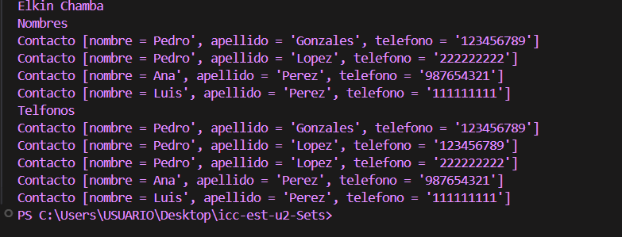
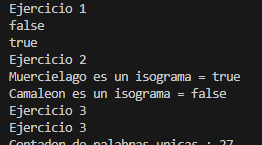

# Práctica: Uso de Sets en Java

## 📌 Información General

- **Título:** Práctica SETS  
- **Asignatura:** Estructura de Datos  
- **Carrera:** Computación  
- **Estudiante:** Elkin Jair Chamba Maura  
- **Fecha:** 01-07-2025  
- **Profesor:** Ing. Pablo Torres  

---

## 🛠️ Descripción

Este proyecto implementa y compara diferentes tipos de **colecciones Set en Java**, usando tanto ordenamientos naturales como personalizados. Las estructuras utilizadas son:

- `HashSet`: No garantiza orden.
- `LinkedHashSet`: Mantiene el orden de inserción.
- `TreeSet`: Ordena los elementos alfabéticamente.
- `TreeSet` con comparador personalizado:
  - Por longitud y orden alfabético.
  - Por longitud descendente y orden alfabético inverso en caso de empate.

Se demuestra cómo cada implementación afecta la organización de los datos.

---

## 🚀 Ejecución

Para ejecutar el proyecto:

1. Compila los archivos:
   ```bash
   javac App.java Controller/Sets.java



